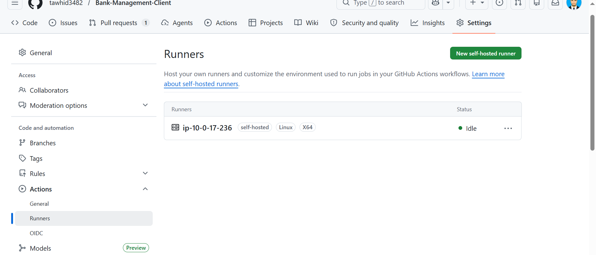
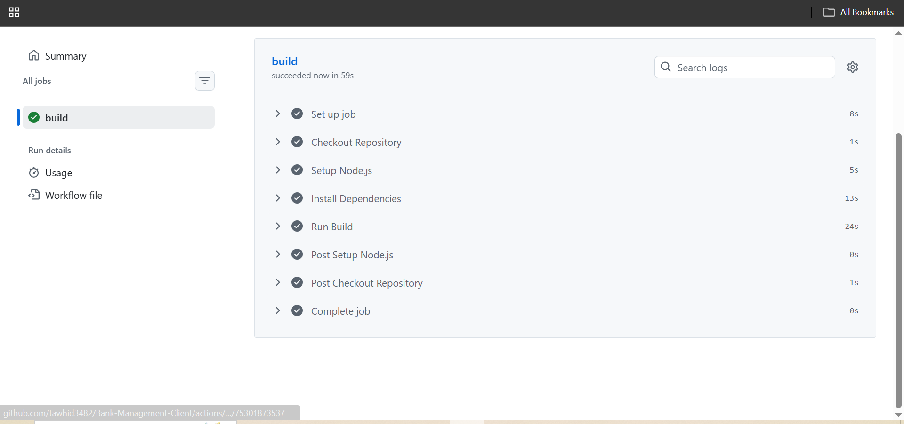
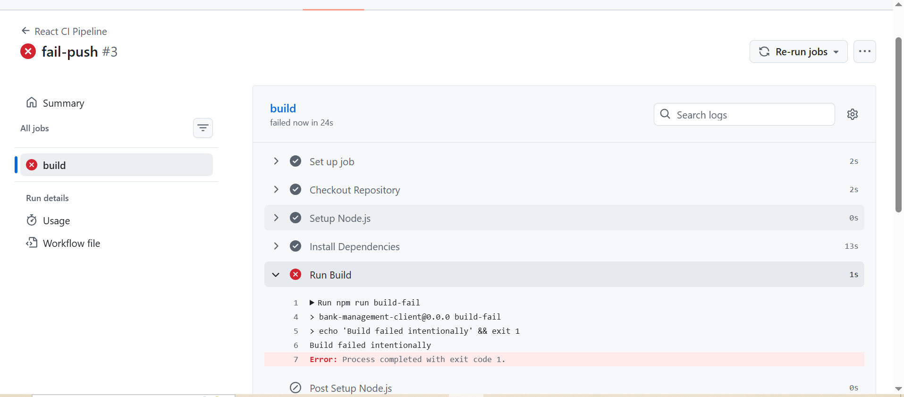

# 🚀 GitHub Actions CI/CD Pipeline (React App)

## 📌 Project Overview

This project demonstrates a simple **CI/CD pipeline** using **GitHub Actions** for a React application. The pipeline automatically runs when code is pushed to the `development` branch and uses a **self-hosted runner** for execution.

---

## ⚙️ Tech Stack

* React + Vite
* Node.js
* GitHub Actions
* Self-hosted Runner (Ubuntu EC2)

---

## 🔄 CI/CD Workflow

### What happens automatically:

1. Developer pushes code to `development` branch
2. GitHub Actions workflow triggers
3. Self-hosted runner picks up the job
4. Dependencies are installed (`npm install`)
5. React app is built (`npm run build`)
6. Success or failure is shown in GitHub Actions logs

---

## 📁 Workflow File

Location:

```
.github/workflows/ci.yml
```

Example Workflow:

```yaml
name: React CI Pipeline

on:
  push:
    branches:
      - development

jobs:
  build:
    runs-on: self-hosted

    steps:
      - name: Checkout Code
        uses: actions/checkout@v4

      - name: Setup Node.js
        uses: actions/setup-node@v4
        with:
          node-version: 20

      - name: Install Dependencies
        run: npm install

      - name: Build Project
        run: npm run build
```

---

## 🖥️ Self-hosted Runner

A self-hosted runner is a personal server (EC2 Ubuntu instance) that executes GitHub Actions jobs instead of GitHub-hosted servers.

### Benefits:

* Full control over environment
* Faster execution for custom setups
* Useful for production-like builds

---

## 🧪 Pipeline Testing

### ✔ Successful Pipeline

* Dependencies installed
* Build completed without errors
* Green checkmark in GitHub Actions

### ❌ Failed Pipeline (Intentional)

* Introduced error in build step
* Workflow fails
* Red status shown in GitHub Actions logs
* Used for debugging practice

---

## 🐛 Debugging Process

If pipeline fails:

* Open GitHub Actions tab
* Click failed workflow
* Check logs step by step
* Identify error in build or dependencies

---

## 📸 Required Submission Screenshots

<p align="center">
  
</p>

<p align="center">
  
</p>

<p align="center">
  
</p>

---


✅ CI/CD (Continuous Integration / Continuous Deployment)

CI/CD is a software development practice that automates the process of integrating code changes, testing, building, and deploying applications.

Continuous Integration (CI): Developers frequently push code to a shared repository, where it is automatically built and tested to detect errors early.
Continuous Deployment/Delivery (CD): After successful testing, the application is automatically deployed to a staging or production environment.

👉 Benefits:

* Faster development workflow
* Early bug detection
* Reduced manual errors
* Improved code quality and reliability
✅ Self-Hosted Runner

A self-hosted runner is a custom machine or server that runs GitHub Actions workflows instead of using GitHub’s default cloud runners.

It can be an EC2 instance, VPS, or a local server configured by the developer.

👉 Features:

* Full control over the execution environment
* Ability to install custom dependencies and tools
* Better flexibility and security
* Useful for private or resource-specific applications

## 📚 Concepts Learned

* CI/CD basics
* GitHub Actions workflow
* Jobs and steps structure
* YAML configuration
* Self-hosted runners
* Pipeline debugging

---

## 🎯 Conclusion

This project automates the React build process using GitHub Actions and demonstrates real-world CI/CD practices using a self-hosted runner environment.
